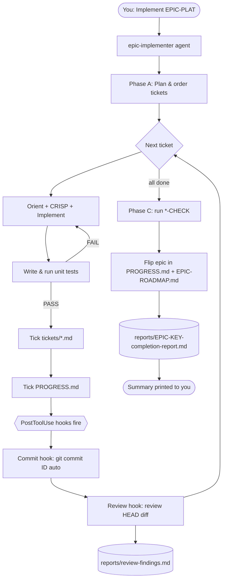

# WORKFLOW — What happens when you implement an epic or ticket

> End-to-end flow for `Implement EPIC-<KEY>` (full epic) or `Implement <TICKET-ID>` (single ticket).
> Covers the agent phases, per-ticket loop, auto-commit + auto-review hooks, and what gets updated.
> Related: `EPIC-ROADMAP.md` · `PROGRESS.md` · `tickets/epic-*.md` · `tickets/<prefix>/<ID>.md` · `.claude/agents/*` · `.claude/settings.json`

## Invocation modes
| What you type | Mode | Phases run |
|---|---|---|
| `Implement EPIC-PLAT` | Epic | A (plan) → B (all tickets) → C (*-CHECK) → D (full report file) |
| `Implement PLAT-1` | Single ticket | B (one ticket only) → D (mini-report, printed only) |

---

## 1. The phases (narrative)

### Epic mode — `Implement EPIC-PLAT`
The **`epic-implementer`** subagent (`claude-sonnet-4-6`) runs:

- **Phase A — Plan:** reads `AGENT-CONTEXT.md` (slim 80-line context) and `tickets/epic-plat-platform.md` (once). Lists every ticket, resolves `Depends on`, outputs a **compact dependency table**. Cross-epic deps not yet done → marked **BLOCKED**.
- **Phase B — Per-ticket loop:** for each ticket → reads `tickets/plat/<ID>.md` only → CRISP applied internally (no output) → implement → write + run unit tests (the gate) → tick `tickets/epic-*.md` → tick `PROGRESS.md` last (fires hooks) → record result.
- **Phase C — Module check:** after all tickets pass, runs the epic's `*-CHECK` → integration + ≥80% coverage + SRS Req IDs → flips epic in `PROGRESS.md` and `EPIC-ROADMAP.md`.
- **Phase D — Report:** writes `reports/EPIC-PLAT-completion-report.md` and prints summary.

### Single-ticket mode — `Implement PLAT-1`
- Skips Phase A and Phase C entirely.
- Checks `Depends on` against `PROGRESS.md` — if unmet → reports BLOCKED and stops.
- Runs Phase B for that one ticket, then prints a mini-report (no file written).

The moment `PROGRESS.md` is saved, **two hooks fire automatically**: a **commit** hook (PowerShell), then a **review** hook (Haiku).

---

## 2. Master flow diagram (whole epic run)

```
              ┌─────────────────────────────────────────────┐
   YOU ──────►│  "Implement EPIC-PLAT"                       │
              └───────────────────┬─────────────────────────┘
                                  ▼
                    ┌──────────────────────────┐
                    │  epic-implementer agent   │
                    └──────────────┬───────────┘
                                   ▼
   ┌─────────────────────── PHASE A: PLAN ───────────────────────┐
   │ read CLAUDE.md + master + epic file                         │
   │ list tickets → resolve Depends on → topological order       │
   │ cross-epic dep missing? → mark BLOCKED                      │
   └──────────────────────────────┬─────────────────────────────┘
                                   ▼
   ┌─────────────────── PHASE B: PER-TICKET LOOP ────────────────┐
   │  for each ticket (PLAT-1 → PLAT-11):                         │
   │     ┌───────────────────────────────────────────────┐       │
   │     │  see "Inner loop" diagram (§3)                 │◄──┐   │
   │     └───────────────────────────────────────────────┘   │   │
   │                         next ticket ────────────────────┘   │
   └──────────────────────────────┬─────────────────────────────┘
                                   ▼
   ┌─────────────────── PHASE C: MODULE CHECK ───────────────────┐
   │ implement + run PLAT-12 (*-CHECK)                           │
   │ integration tests + coverage ≥80% + SRS Req IDs verified    │
   │ flip epic ☐→☑ in PROGRESS.md AND EPIC-ROADMAP.md            │
   └──────────────────────────────┬─────────────────────────────┘
                                   ▼
   ┌─────────────────── PHASE D: REPORT ─────────────────────────┐
   │ write reports/EPIC-PLAT-completion-report.md                │
   │ print summary (done / blocked / failed, coverage, Req IDs)  │
   └─────────────────────────────────────────────────────────────┘
```

---

## 3. Inner loop (one ticket) — with the test gate

```
   pick ticket  ──►  ORIENT (read ticket + scan repo for what exists)
                          │
                          ▼
                     CONVERT to CRISP (Context/Role/Instructions/Style/Parameters)
                          │
                          ▼
                     IMPLEMENT (create/edit files per repo layout + §2 conventions)
                          │
                          ▼
                     WRITE the ticket's Unit Tests
                          │
                          ▼
                     RUN tests (pytest / vitest)
                          │
              ┌───────────┴───────────┐
          FAIL │                       │ PASS  ◄── THE GATE
              ▼                       ▼
          fix & re-run        tick [x] in tickets/epic-*.md
          (DO NOT advance)            │
                                      ▼
                          tick [x] in PROGRESS.md   ◄── saving this FIRES HOOKS (see §4)
                                      │
                                      ▼
                          record result → next ticket
```
> The agent does **not** run `git commit` itself — the commit hook does it (no double-commit).

---

## 4. The hook chain (fires when PROGRESS.md is saved)

```
   PROGRESS.md saved (Edit)  ──►  PostToolUse(Edit|Write) event
                                          │
                  ┌───────────────────────┴───────────────────────┐
                  ▼                                                 ▼
        [Hook 1: COMMAND]                                 [Hook 2: AGENT]
   commit-on-task-complete.ps1                    crm-reviewer (claude-haiku-4-5)
        │                                                   │
   is file PROGRESS.md? ──no──► exit                    if Edit(**/PROGRESS.md)
        │ yes                                               │
   new "[x] TICKET-ID"? ──no──► exit                    tree clean + HEAD ends "[auto]"? ──no──► skip
        │ yes                                               │ yes
   git add -A                                           git show HEAD  (diff only)
   git commit -m "PLAT-1: ... [auto]"                  reads tickets/<prefix>/<ID>.md only
        │                                               review: bugs · security(OWASP/§5.2) ·
   Co-Authored-By: Claude Sonnet 4.6                      validation · conventions · tests · SRS
   (push line: off until you add remote)                   │
        └──► systemMessage: "Auto-committed: …"          APPEND entry to reports/review-findings.md
                                                          (never re-reads full file — append only)
                                                            │
                                                          systemMessage: VERDICT (PASS/CHANGES-NEEDED)
```
Hooks run **in array order**: commit first (so HEAD exists), review second (reviews that commit).

---

## 5. Swimlane — who does what

```
ACTOR                    │ ACTION
─────────────────────────┼───────────────────────────────────────────────────────
You                      │ "Implement EPIC-PLAT"  OR  "Implement PLAT-1"
epic-implementer         │ detect mode → load AGENT-CONTEXT.md (slim, once)
   (claude-sonnet-4-6)   │ epic: plan table → per ticket: orient, CRISP(silent), code, tests
                         │ single: check deps → orient, CRISP(silent), code, tests
                         │ tick tickets/<prefix>/<ID>.md  →  tick PROGRESS.md ─┐
─────────────────────────┼──────────────────────────────────────────────────────┼──────
Commit hook              │ (auto on PROGRESS.md save) git add -A
   (PowerShell)          │ git commit "<ID>: summary [auto]"
                         │ Co-Authored-By: Claude Sonnet 4.6                    │
Review hook              │ (auto, after commit) reads diff + tickets/<prefix>/<ID>.md only
   (claude-haiku-4-5)    │ append-only → reports/review-findings.md, print VERDICT
─────────────────────────┼───────────────────────────────────────────────────────────────
epic-implementer         │ (epic mode) ...next ticket... then *-CHECK
   (agent)               │ flip epic in PROGRESS.md + EPIC-ROADMAP.md → write report
You                      │ read report + findings log → fix any Critical/High next
```

---

## 6. What gets created/updated (per ticket vs per epic)

| Artifact | Per **ticket** | Per **epic** |
|----------|:--------------:|:------------:|
| Source code (`apps/api`, `apps/web`, `prisma`) | ✅ | — |
| Unit/integration tests | ✅ | ✅ (check) |
| `tickets/epic-*.md` checkboxes | ✅ | ✅ (`*-CHECK`) |
| `PROGRESS.md` (ticket box + count) | ✅ | ✅ (epic heading) |
| `EPIC-ROADMAP.md` (epic row + Overall) | — | ✅ |
| Git commit | ✅ (1 per ticket, via hook) | — |
| `reports/review-findings.md` | ✅ (1 entry per commit) | — |
| `reports/EPIC-<KEY>-completion-report.md` | — | ✅ |

---

## 7. Branch handling (what if something goes wrong)

```
test FAIL          → stay on ticket, fix, re-run (never tick, never commit)
cross-epic dep     → mark BLOCKED, skip ticket, keep going, list in report
review CHANGES-    → logged in findings; advisory (commit already made);
  NEEDED              fix in a follow-up (safe — no concurrent agents)
EPIC-SEED          → agent SKIPS it unless you explicitly asked
ambiguous ticket   → smallest reasonable assumption, noted in report, continue
```

---

## 8. Mermaid version (renders in Markdown viewers)



---

### One-line summary
**You ask → the agent plans tickets in dependency order → builds+tests each (tests gate completion) →
ticking PROGRESS.md auto-commits then auto-reviews each commit → after the module check it flips the epic in
both trackers and writes a completion report — you just read the report and fix any flagged findings.**
