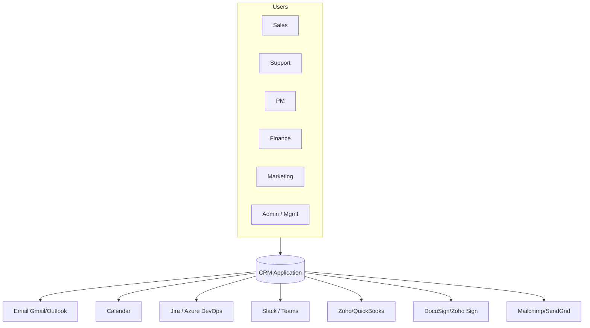
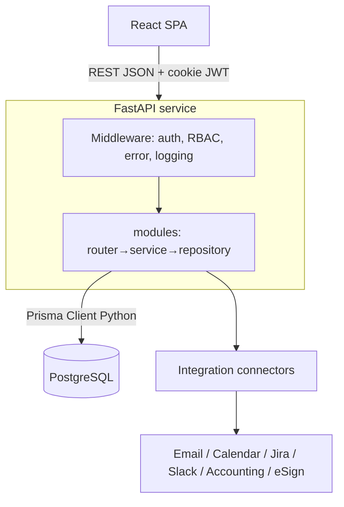
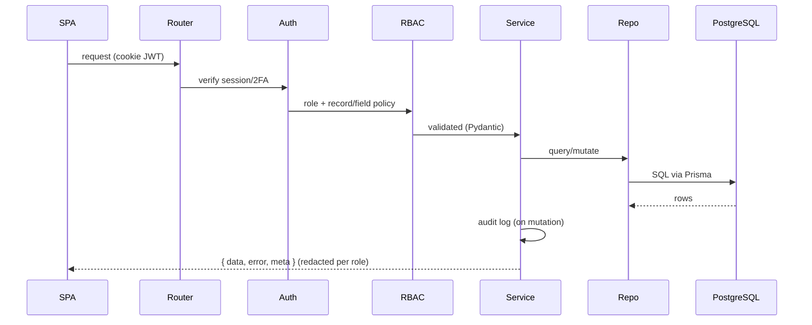
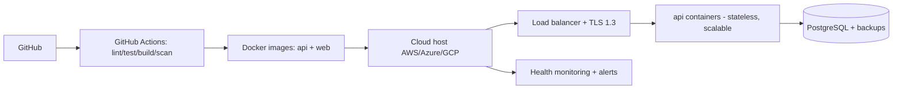

# Architecture — CRM (IT Services)

> System, container, deployment, request-lifecycle, and auth/RBAC views. Derived from the SRS (§2.3, §5) and
> the project stack. Diagrams in ASCII + Mermaid. Companion: `BUSINESS-FLOW.md`, `TECH-DESIGN.md`.

---

## 1. System context (who & what talks to the CRM)

```
        ┌─────────────────────────────────────────────────────────────┐
        │                     CRM Application                          │
 Users  │   (React SPA  ⇄  FastAPI REST  ⇄  PostgreSQL)                │  External systems
 ─────► │                                                             │ ◄──────────────────
 Sales  │                                                             │  Gmail/Outlook (email)
 Support│                                                             │  Google/Outlook Calendar
 PM     │                                                             │  Jira / Azure DevOps
 Finance│                                                             │  Slack / MS Teams
 Mktg   │                                                             │  Zoho/QuickBooks (accounting)
 Admin  │                                                             │  DocuSign/Zoho Sign (eSign)
 Mgmt   │                                                             │  Mailchimp/SendGrid (email mktg)
        └─────────────────────────────────────────────────────────────┘
```



---

## 2. Container / component view

```
 ┌───────────────────────────────────────────────────────────────────────┐
 │ Browser                                                                │
 │  ┌──────────────────────────────────────────────────────────────────┐ │
 │  │ React 18 SPA (Vite + TS, Tailwind+DaisyUI, TanStack Query)        │ │
 │  │  features/<module> · components(ui/layout/charts) · lib/apiClient │ │
 │  └───────────────────────────────┬──────────────────────────────────┘ │
 └──────────────────────────────────┼────────────────────────────────────┘
                       HTTPS (JSON, httpOnly cookie JWT)
                                    ▼
 ┌───────────────────────────────────────────────────────────────────────┐
 │ FastAPI service (Python, async)                                        │
 │   middleware: auth · RBAC · error envelope · structlog                 │
 │   modules/<module>/  router → service → repository                     │
 │   core/ (config, security, logging)   db/ (Prisma client wrapper)      │
 └───────────────┬───────────────────────────────────┬───────────────────┘
                 │ Prisma Client Python              │ connectors (OAuth/tokens, webhooks)
                 ▼                                    ▼
       ┌──────────────────┐                 ┌──────────────────────────┐
       │ PostgreSQL        │                 │ External integrations     │
       │ (all module data, │                 │ email/cal/Jira/Slack/...  │
       │  audit, indexes)  │                 └──────────────────────────┘
       └──────────────────┘
```



---

## 3. Request lifecycle (one API call)

```
 SPA fetch ─► HTTPS ─► FastAPI router
                          │ 1. auth dependency (verify JWT cookie, 2FA state)
                          │ 2. RBAC dependency (role + record/field policy)
                          │ 3. Pydantic validation (422 on bad input)
                          ▼
                       service (business logic)
                          │ 4. repository (Prisma) → PostgreSQL
                          │ 5. audit log on mutation
                          ▼
                       response envelope { data, error, meta }
                          │ 6. field-level redaction per role
                          ▼
                 SPA (TanStack Query cache) ─► UI render
```



---

## 4. Authentication & RBAC flow (SRS §5.2)

```
 login (email+pwd) ─► verify (bcrypt) ─► 2FA enabled? ─yes─► TOTP verify
        │ no                                   │
        ▼                                      ▼
   issue JWT (httpOnly+SameSite cookie, 30-min sliding)
        │
   every request ─► auth dep ─► RBAC dep ─► (role ability) + (record owner) + (field redaction)
        │                                        │ deny ─► 403
        ▼                                        ▼ allow
   audit log (logins, mutations, admin actions)  handler runs
```

---

## 5. Deployment view (SRS §2.3)

```
 GitHub repo ──push/PR──► GitHub Actions CI/CD
   │                         lint → typecheck → pytest(+Postgres) → vitest → build → security scan → deploy gate
   ▼
 Docker images: [api] [web]  +  managed PostgreSQL
   │
   ▼
 Cloud host (AWS/Azure/GCP) — containers behind load balancer, TLS 1.3
   • horizontal scaling (stateless API)   • daily backups (30-day)   • health monitoring/alerts
```



---

## 6. Cross-cutting concerns

| Concern | Where it lives |
|---------|----------------|
| AuthN/AuthZ | FastAPI dependencies (auth + RBAC), middleware |
| Validation | Pydantic (API) + Zod (forms, shared) |
| Error handling | exception handlers → `{data,error,meta}`; 422 field errors |
| Logging | structlog JSON (ELK-ready), request IDs |
| Audit | audit service on all mutations/logins/admin actions |
| Caching/perf | pagination, indexes, materialized report views |
| Security | TLS 1.3, AES-256 at rest, 2FA, OWASP, session timeout |
| Observability | health checks, monitoring/alerts, CI gates |

---

## 7. Data model (ERD)

The full ERD is **generated from the live Prisma schema** in ticket **DB-15** (EPIC-DB) and will be saved as
`docs/ERD.png` + `DATA_DICTIONARY.md`. Until then, the authoritative table list is the EPIC-DB schema tickets
(DB-3…DB-11) in `tickets/epic-db.md`.
