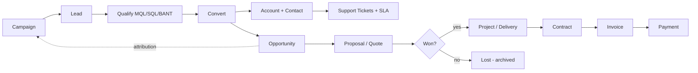
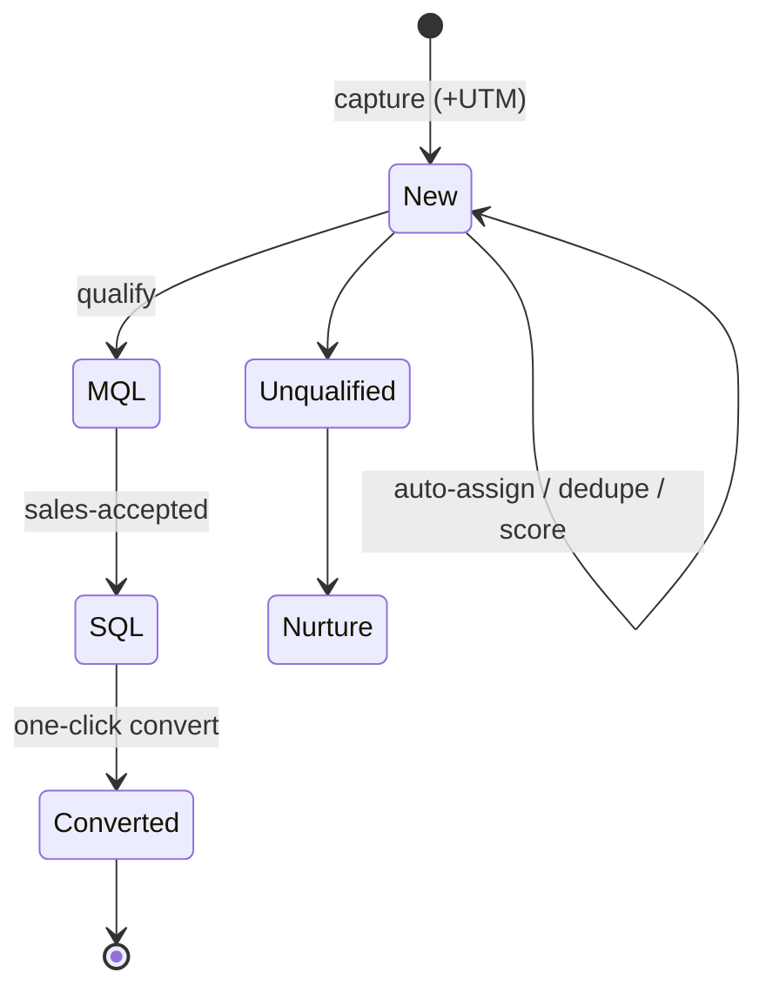
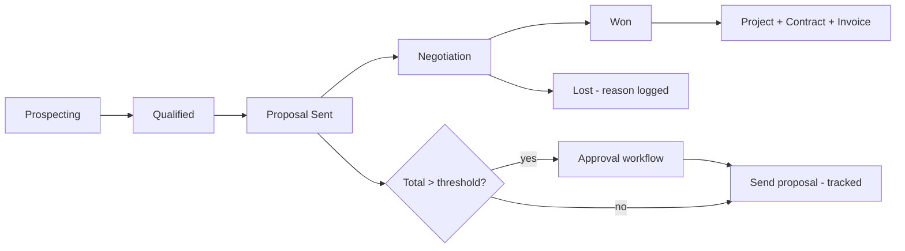
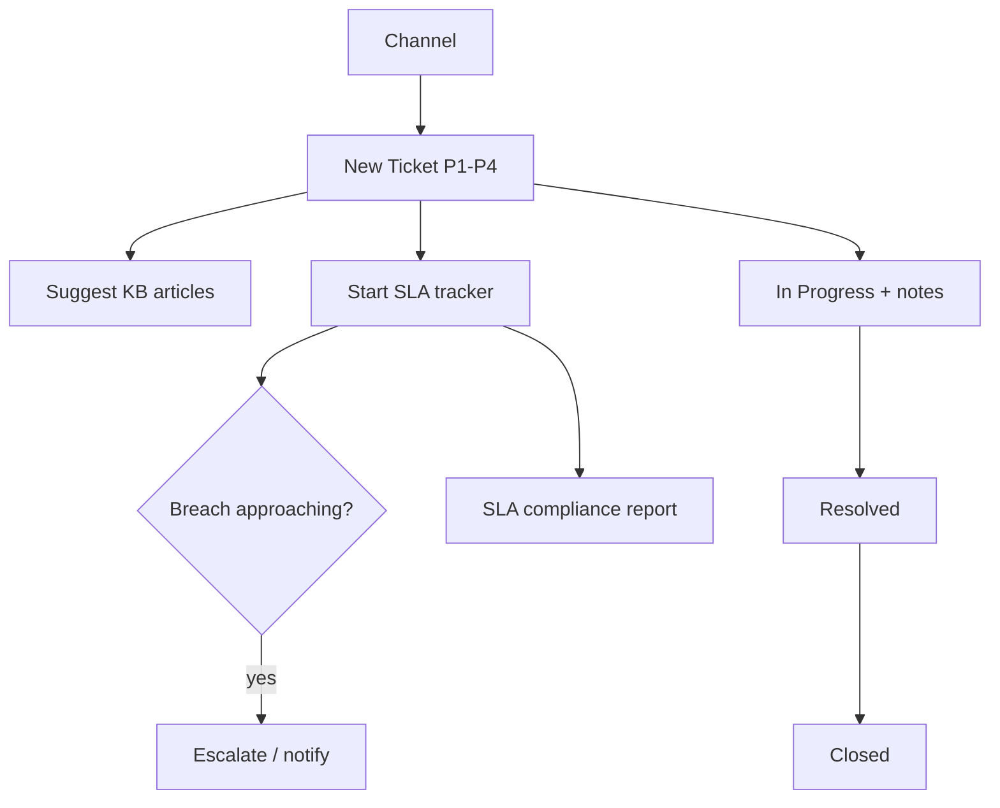

# Business Flow — CRM (IT Services)

> Business-process flowcharts for the CRM, derived from the SRS (§3 functional modules). Shows how work moves
> across modules end to end. Diagrams in ASCII + Mermaid. Companion: `ARCHITECTURE.md`, `TECH-DESIGN.md`.

---

## 1. End-to-end CRM lifecycle (the big picture)

```
 MARKETING        SALES                         DELIVERY / FINANCE            SUPPORT
 ─────────        ─────                         ──────────────────            ───────
 Campaign ─► Lead ─► Qualify ─► Convert ─► Opportunity ─► Won ─► Project ─► Contract ─► Invoice ─► Payment
                                  │            │                                              │
                                  ▼            ▼                                              ▼
                            Account+Contact  Proposal/Quote                            Ticket + SLA (ongoing)
```



---

## 2. Lead lifecycle (SRS §3.1)

```
 Sources (web/email/LinkedIn/referral/manual)
        │  capture + UTM
        ▼
   [New Lead] ──► auto-assign (territory/round-robin)
        │
        ├─► duplicate check ──(dup)──► merge
        │
        ▼
   scoring engine ──► score + grade
        │
        ▼
   qualify ──┬─► MQL ─► SQL ──► [Convert] ─► Account + Contact + Opportunity
             ├─► Unqualified ─► nurture / drip campaign
             └─► invalid ─► discard
```



---

## 3. Sales pipeline (SRS §3.3)

```
 Prospecting ─► Qualified ─► Proposal Sent ─► Negotiation ─► Won
      │             │              │               │           │
      └─ drag/drop across stages (probability per stage) ──────┘
                         │
                 Proposal/Quote ─► (above threshold?) ─► Approval ─► Send (tracked) ─► accept/reject
                         │
                  Won ─► create Project + Contract + Invoice
                  Lost ─► reason logged, archived
```



---

## 4. Delivery → billing (SRS §3.6–3.8)

```
 Won Opportunity
     │
     ▼
 [Project] ── phases ─► milestones ─► tasks (assignee+effort) ─► status (NotStarted…Completed/Delayed)
     │  (Jira sync bidirectional)
     ▼
 [Contract] ── terms/dates/value/auto-renew ─► eSignature ─► active
     │
     ▼
 [Invoice] ── line items + GST ─► Draft ─► Sent ─► (Paid | Overdue) ─► Payment recorded
     │  (accounting sync: Zoho/QuickBooks)
     ▼
 Revenue recognition (month/quarter/year)
```

---

## 5. Support ticket + SLA flow (SRS §3.5)

```
 Channel (email/portal/phone/manual)
        │ create ticket (category, priority P1–P4)
        ▼
   KB suggestions shown ─► [Open] ──► SLA tracker starts (response/resolution due)
        │                                   │
   assign + work (internal/customer notes)  ├─ approaching breach ─► escalate/notify
        │                                   │
        ▼                                   ▼
   [Resolved] ─► [Closed]              SLA met / breached ─► compliance report
```



---

## 6. Contract renewal flow (SRS §3.7)

```
 Active Contract ──(scheduler)──► 90 days ─► reminder
                                  60 days ─► reminder
                                  30 days ─► reminder + renewal task
        │
        ├─ auto-renew = true ─► renew + new term + (re-sign if needed)
        └─ auto-renew = false ─► Account Mgr action ─► renew / amend / let lapse
```

---

## 7. Campaign → revenue attribution (SRS §3.9)

```
 Campaign (segment audience) ─► send / drip ─► metrics (open/click/convert)
        │
        ▼
   Leads generated ─► (convert) ─► Opportunities ─► Won ─► Revenue
        └────────────── attribution back to Campaign ──────────► Campaign ROI report
```

---

## 8. Roles touching each flow (SRS §2.2)

| Flow | Primary roles |
|------|---------------|
| Lead → Convert | Marketing, Sales Executive |
| Pipeline → Proposal | Sales Executive, Sales Manager (approval) |
| Project delivery | Project Manager, delivery team |
| Contract / Renewal | Account Manager, Finance |
| Invoice / Payment | Finance |
| Ticket / SLA | Support Engineer, Support Manager |
| Campaign / ROI | Marketing |
| Dashboards / KPIs | Management / C-Suite, all managers |
