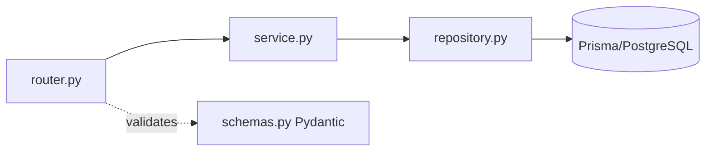

# Technical Design — CRM (IT Services)

> Consolidated technical design: stack rationale, backend/frontend design, API standards, data, security,
> integrations, testing, and NFR design. Derived from the SRS + project conventions (`CLAUDE.md`).
> Companion: `ARCHITECTURE.md`, `BUSINESS-FLOW.md`.

---

## 1. Stack & rationale

| Layer | Choice | Why |
|-------|--------|-----|
| Frontend | React 18 SPA (Vite + TS) | Component-rich CRM UI; matches existing DaisyUI mockups |
| UI | Tailwind + DaisyUI (lemonade) | Fast, consistent design system; mockups already in this style |
| Data fetching | TanStack Query | Caching, invalidation, loading/error states out of the box |
| Backend | FastAPI (Python, async) | Async REST, Pydantic validation, OpenAPI auto-docs |
| ORM/DB | Prisma Client Python + PostgreSQL | Typed models, migrations; relational fit for CRM |
| Auth | JWT (httpOnly) + 2FA TOTP + RBAC | SRS §5.2 security requirements |
| Tests | pytest + Vitest/RTL | API + component coverage, ≥80% gate |
| Infra | Docker + GitHub Actions | SRS §2.3 containerized CI/CD |

---

## 2. Backend design — layered modules

```
 apps/api/app/modules/<module>/
   router.py       # FastAPI routes; thin; auth+RBAC deps; calls service
   service.py      # business logic; orchestrates repos; audit; pure-ish, testable
   repository.py   # Prisma access; no business logic
   schemas.py      # Pydantic request/response models (validation at the edge)
```
**Rules:** routers thin, logic in services, DB access only in repositories, validation only via Pydantic.
No business logic in routers or repositories. One module folder per resource.



---

## 3. Frontend design

```
 apps/web/src/
   features/<module>/   pages/  components/  hooks(useXxx + TanStack Query)  api/
   components/  ui/ (Button, Card, Table, Modal…)  layout/ (Sidebar, Header, PageShell)  charts/
   lib/  apiClient (axios, envelope unwrap)  auth (context, guard)  cn()
```
- One component per file, **PascalCase named exports**. Hooks `useXxx`. Forms = react-hook-form + Zod.
- Pages wrap in `PageShell`; consistent Sidebar/Header; DaisyUI lemonade; mobile-first; no horizontal scroll.

---

## 4. API design standards

- **Envelope (always):** `{ "data": ..., "error": ..., "meta": ... }`.
- **Status codes:** 200/201 success, 422 validation, 401 unauthenticated, 403 forbidden, 404 missing.
- **Validation:** every request body via Pydantic before any DB access.
- **Pagination/filter/sort:** list endpoints support `?page&limit&sort&filter`, return `meta` (total, page).
- **Versioning/docs:** OpenAPI at `/docs`; keep current as modules are added.
- **Idempotency:** mutations audited; conversions/transactions atomic (Prisma transaction).

---

## 5. Data design

- UUID PKs; `createdAt/updatedAt`; soft-delete `deletedAt` (recycle bin, SRS §8.2).
- Enums defined once (shared) and mirrored to Python.
- Indexes on hot paths (status, ownerId, dates, polymorphic pairs); unique constraints (e.g. invoice number).
- Cross-module FKs with explicit `onDelete` (Restrict/Cascade/SetNull). Full schema = EPIC-DB (DB-1…16).
- Polymorphic links (Activity/Comment `relatedTo` = type+id) indexed.

---

## 6. Security design (SRS §5.2)

| Control | Design |
|---------|--------|
| AuthN | bcrypt; JWT in httpOnly+SameSite cookie; 30-min sliding session |
| 2FA | TOTP (authenticator); encrypted secret; backup codes |
| AuthZ | RBAC dependency: role-ability map + record-ownership + **field-level redaction** |
| Encryption | TLS 1.3 in transit; AES-256 at rest; integration tokens encrypted |
| Audit | central audit service on all mutations, logins, admin actions |
| Input safety | Pydantic/Zod; parameterized ORM; allowlist fields in custom report builder (no injection) |
| Hardening | OWASP Top 10; rate-limit auth; security scan in CI (fail on High/Critical) |

---

## 7. Integration design (SRS §6)

```
 modules consume a shared Connector Framework (EPIC-INTG):
   OAuth2 connect ─► encrypted token vault ─► provider client ─► webhook receiver (verified) ─► retry/backoff
```
- Each integration (email, calendar, Jira, Slack/Teams, accounting, eSign, email-mktg) is a thin adapter over
  the framework. Module logic calls the adapter; tokens never leave the vault unencrypted.
- Webhooks verified by signature; idempotent handlers; conflict resolution for bidirectional Jira sync.

---

## 8. Error handling & observability

- FastAPI exception handlers → envelope; Pydantic errors → 422 with field details.
- structlog JSON logs with request IDs (ELK-ready); secrets redacted.
- Health endpoint + monitoring/alerts (SRS §5.3). Feature flags for controlled rollout (SRS §5.6).

---

## 9. Testing strategy (SRS §5.6)

| Level | Tooling | Scope |
|-------|---------|-------|
| Unit | pytest / Vitest | services (scoring, SLA, forecasting), validators, pure functions |
| Integration | httpx ASGI + test Postgres | API routes incl. auth/RBAC, transactions |
| Component | React Testing Library | behavior of pages/forms/boards |
| Coverage | gate ≥80% | services/routers/features; CI fails below |
- Edge cases: empty data, rate-limited integrations, expired sessions, SLA breaches, zero-metric ranges.
- No snapshot tests. Every ticket ships its own unit tests.

---

## 10. Non-functional design (SRS §5)

| NFR | Design approach |
|-----|-----------------|
| Performance (<2s page, P95<500ms) | pagination, indexes, caching/materialized report views, async I/O |
| Scalability (1,000 users, 10M rows) | stateless API (horizontal scale), connection pooling, indexing |
| Reliability (99.9%) | daily backups (30-day), DR runbook, health monitoring |
| Usability (WCAG 2.1 AA) | responsive 375px+, a11y audit, onboarding wizard, ≤3-click rule |
| Maintainability | ≥80% coverage, OpenAPI docs, feature flags, centralized logging |

---

## 11. Traceability
Every design decision maps to SRS sections and is realized by tickets in `tickets/epic-*.md`
(see `CRM_IMPLEMENTATION_TASKS.md §6` traceability matrix). The ERD + data dictionary are generated in **DB-15**.
